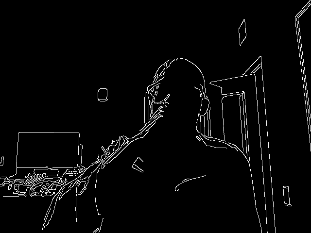

# 🧰 Python Toolbox

A versatile collection of Python tools and design patterns for **AI**, **computer vision**, and **modern Python development**. This repo serves as a **reference library**, **learning playground**, and **launchpad** for smarter, reusable code.

---

## 📦 What's Included

- 🧠 **AI & Vision Tasks**: frame processing, webcam pipelines, thresholding, etc.
- 🧱 **OOP Design**: reusable classes, `self`-powered pipelines, method maps
- 🧪 **Efficient Python**: lambdas, partials, argparse-based CLIs, directory tools

---

## 🖼️ Demo Snapshots

### 🎥 Live Frame Pipeline (Webcam View)


> Grayscale → Blur → Canny Edge Detection in real time.
> python main.py --steps gray blur canny

---

### 🧱 Code Example: Build a Custom Pipeline
```python
def build_pipeline(self, steps):
    step_map = {
        "gray": self.do_gray,
        "blur": lambda f: self.do_blur(f, (3, 3)),
        "canny": lambda f: self.do_canny(f, 50, 150),
    }
    return [step_map[name] for name in steps if name in step_map]


🤝 Installation
git clone https://github.com/yourusername/python-toolbox.git
cd python-toolbox
pip install -r requirements.txt
python main.py --steps gray blur canny

🤝 Contributing
Have a useful snippet, vision trick, or structural pattern to share? PRs and issues are welcome.

📜 License
MIT License — use freely, build boldly.

💡 Author Notes
This repo focuses on readable, modular, and production-friendly Python for real-world computer vision pipelines. Designed to grow with you.


├── Mathematics
├── Webcam-Class
│   ├── Packaged
│   │   ├── camera_edge
│   ├── Standalones
│   │   ├── Basic
│   │   ├── Moderate
│   │   ├── Pipeline
│   └── readme.txt
├── bonsai.py
├── readme.md
└── tree.py